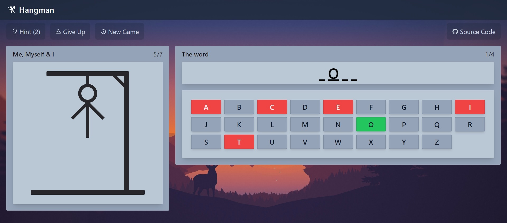

# Hangman Game

A simple, web-based hangman game.  
You can find the demo application [here](https://0l1v3rr.github.io/hangman-game).



<hr>

## Teach stack

- [TypeScript](https://www.typescriptlang.org/)
- [React](https://reactjs.org/)
- [React-Icons](https://react-icons.github.io/react-icons/)
- [Tailwind](https://tailwindcss.com/)
- [React GH Pages](https://github.com/gitname/react-gh-pages)

<hr>

## Building from source

If you don't have NodeJS, [download and install it](https://nodejs.org/en/).  
Then open a terminal and type these commands:

```sh
# 1. Clone the project:
git clone https://github.com/0l1v3rr/hangman-game.git
cd hangman-game
# 2. Install the dependencies:
npm i
# 3. Run the application:
npm start
```

<hr>

## License

This project is licensed under the [MIT License](LICENSE).